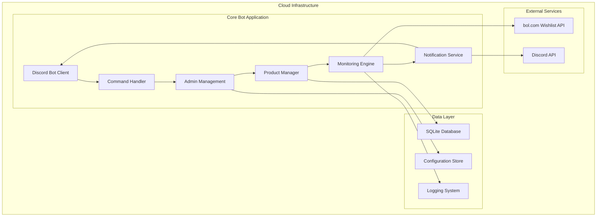

# Design Document

## Overview

The Pokemon Discord Bot is a high-performance monitoring system that tracks bol.com product availability and delivers near real-time notifications to Discord servers. The system prioritizes speed (1-second notification target) and reliability through a modular, cloud-based architecture that leverages existing scraper technology while providing comprehensive admin management capabilities.

## Architecture

### High-Level Architecture



### Component Architecture

The system follows a modular plugin-based design with clear separation of concerns:

1. **Discord Integration Layer** - Handles all Discord API interactions
2. **Admin Management Layer** - Manages permissions, configuration, and user interfaces  
3. **Monitoring Engine** - Core scraping and change detection logic
4. **Data Persistence Layer** - Database operations and configuration management
5. **Notification Service** - Message formatting and delivery management

## Components and Interfaces

### 1. Discord Bot Client (`discord_client.py`)

**Purpose:** Main Discord bot interface and command routing

**Key Responsibilities:**
- Discord API connection management
- Slash command registration and handling
- Event listening and processing
- Bot lifecycle management

**Interface:**
```python
class DiscordBotClient:
    async def setup_commands(self) -> None
    async def handle_admin_command(self, interaction: Interaction) -> None
    async def send_notification(self, channel_id: int, embed: Embed) -> bool
    async def validate_permissions(self, user_id: int, guild_id: int) -> bool
```

### 2. Monitoring Engine (`monitoring_engine.py`)

**Purpose:** Core product monitoring using existing scraper technology

**Key Responsibilities:**
- Wishlist URL monitoring (primary method)
- Product page monitoring (secondary method)
- Stock change detection and caching
- Anti-detection measures implementation
- Performance optimization

**Interface:**
```python
class MonitoringEngine:
    async def monitor_wishlist(self, wishlist_url: str) -> List[ProductData]
    async def monitor_product(self, product_url: str) -> ProductData
    async def detect_stock_changes(self, products: List[ProductData]) -> List[StockChange]
    async def start_monitoring(self, product_configs: List[ProductConfig]) -> None
    async def stop_monitoring(self, product_id: str) -> None
```

**Enhanced Scraper Integration:**
- Leverage existing aiohttp + lxml implementation
- Maintain compatibility with current ProductData schema
- Implement cache-busting with timestamp parameters
- Add Dutch text parsing for pre-order detection

### 3. Product Manager (`product_manager.py`)

**Purpose:** Product configuration and database management

**Key Responsibilities:**
- Product CRUD operations
- Channel assignment management
- Configuration validation
- Monitoring status tracking

**Interface:**
```python
class ProductManager:
    async def add_product(self, url: str, channel_id: int, config: ProductConfig) -> str
    async def remove_product(self, product_id: str) -> bool
    async def update_product(self, product_id: str, config: ProductConfig) -> bool
    async def get_products_by_channel(self, channel_id: int) -> List[Product]
    async def get_monitoring_status(self) -> Dict[str, MonitoringStatus]
```

### 4. Admin Management (`admin_manager.py`)

**Purpose:** Administrative interface and permission management

**Key Responsibilities:**
- Permission validation
- Admin command processing
- Dashboard data aggregation
- Configuration management

**Interface:**
```python
class AdminManager:
    async def validate_admin_permissions(self, user_id: int, guild_id: int) -> bool
    async def process_add_product_command(self, interaction: Interaction) -> None
    async def process_status_command(self, interaction: Interaction) -> None
    async def get_dashboard_data(self, guild_id: int) -> DashboardData
```

### 5. Notification Service (`notification_service.py`)

**Purpose:** Discord notification formatting and delivery

**Key Responsibilities:**
- Rich embed creation
- Role mention management
- Notification queuing and retry logic
- Rate limit compliance

**Interface:**
```python
class NotificationService:
    async def create_stock_notification(self, product: ProductData, change: StockChange) -> Embed
    async def send_notification(self, channel_id: int, embed: Embed, mentions: List[str]) -> bool
    async def queue_notification(self, notification: Notification) -> None
    async def process_notification_queue(self) -> None
```

## Data Models

### Core Data Structures

**ProductData Schema (Enhanced from existing):**
```python
@dataclass
class ProductData:
    title: str
    price: str
    original_price: str
    image_url: str
    product_url: str
    uncached_url: str
    stock_status: str  # "In Stock" / "Out of Stock"
    stock_level: str
    website: str
    delivery_info: str
    sold_by_bol: bool
    last_checked: datetime
    product_id: str  # New: unique identifier
```

**Product Configuration:**
```python
@dataclass
class ProductConfig:
    product_id: str
    url: str
    url_type: str  # "wishlist" or "product"
    channel_id: int
    guild_id: int
    monitoring_interval: int  # seconds
    role_mentions: List[str]
    is_active: bool
    created_at: datetime
    updated_at: datetime
```

**Stock Change Event:**
```python
@dataclass
class StockChange:
    product_id: str
    previous_status: str
    current_status: str
    timestamp: datetime
    price_change: Optional[PriceChange]
    notification_sent: bool
```

### Database Schema

**SQLite Tables:**

```sql
-- Products table
CREATE TABLE products (
    id TEXT PRIMARY KEY,
    url TEXT NOT NULL,
    url_type TEXT NOT NULL,
    channel_id INTEGER NOT NULL,
    guild_id INTEGER NOT NULL,
    monitoring_interval INTEGER DEFAULT 60,
    role_mentions TEXT, -- JSON array
    is_active BOOLEAN DEFAULT TRUE,
    created_at TIMESTAMP DEFAULT CURRENT_TIMESTAMP,
    updated_at TIMESTAMP DEFAULT CURRENT_TIMESTAMP
);

-- Product status tracking
CREATE TABLE product_status (
    product_id TEXT,
    title TEXT,
    price TEXT,
    stock_status TEXT,
    stock_level TEXT,
    last_checked TIMESTAMP,
    FOREIGN KEY (product_id) REFERENCES products(id)
);

-- Stock change history
CREATE TABLE stock_changes (
    id INTEGER PRIMARY KEY AUTOINCREMENT,
    product_id TEXT,
    previous_status TEXT,
    current_status TEXT,
    timestamp TIMESTAMP DEFAULT CURRENT_TIMESTAMP,
    notification_sent BOOLEAN DEFAULT FALSE,
    FOREIGN KEY (product_id) REFERENCES products(id)
);

-- Performance metrics
CREATE TABLE monitoring_metrics (
    id INTEGER PRIMARY KEY AUTOINCREMENT,
    product_id TEXT,
    check_duration_ms INTEGER,
    success BOOLEAN,
    error_message TEXT,
    timestamp TIMESTAMP DEFAULT CURRENT_TIMESTAMP,
    FOREIGN KEY (product_id) REFERENCES products(id)
);
```

## Error Handling

### Error Categories and Strategies

**1. Network Errors (bol.com connectivity)**
- Implement exponential backoff (1s, 2s, 4s, 8s, max 30s)
- Retry up to 3 times before marking as failed
- Log detailed error information for analysis
- Continue monitoring other products

**2. Discord API Errors**
- Queue notifications for retry on rate limits
- Implement Discord.py built-in retry mechanisms
- Fallback to alternative notification methods
- Log API errors with context

**3. Database Errors**
- Implement connection pooling and retry logic
- Graceful degradation: continue monitoring without persistence
- Automatic database recovery procedures
- Regular database health checks

**4. Parsing Errors (HTML structure changes)**
- Fallback to alternative CSS selectors
- Log parsing failures with HTML samples
- Alert administrators of potential site changes
- Maintain monitoring for other products

### Error Recovery Mechanisms

```python
class ErrorHandler:
    async def handle_network_error(self, error: Exception, product_id: str) -> None
    async def handle_discord_error(self, error: Exception, notification: Notification) -> None
    async def handle_database_error(self, error: Exception, operation: str) -> None
    async def handle_parsing_error(self, error: Exception, html_content: str) -> None
```

## Testing Strategy

### Unit Testing
- **Component Testing:** Individual class and method testing
- **Mock External Services:** bol.com responses, Discord API calls
- **Database Testing:** SQLite operations and schema validation
- **Error Simulation:** Network failures, API errors, parsing issues

### Integration Testing
- **End-to-End Workflows:** Product addition → monitoring → notification
- **Discord Integration:** Command handling, permission validation, message delivery
- **Database Integration:** Data persistence and retrieval operations
- **Performance Testing:** Monitoring speed and resource usage

### Load Testing
- **Concurrent Monitoring:** Multiple products simultaneously
- **Discord Rate Limits:** Notification delivery under load
- **Database Performance:** High-frequency read/write operations
- **Memory Usage:** Long-running monitoring sessions

### Test Implementation Structure
```python
# tests/
├── unit/
│   ├── test_monitoring_engine.py
│   ├── test_product_manager.py
│   ├── test_notification_service.py
│   └── test_admin_manager.py
├── integration/
│   ├── test_discord_integration.py
│   ├── test_database_operations.py
│   └── test_end_to_end_workflows.py
└── performance/
    ├── test_monitoring_performance.py
    └── test_notification_speed.py
```

## Performance Optimizations

### Monitoring Speed Optimizations
1. **Async Processing:** Concurrent wishlist monitoring using asyncio
2. **Connection Pooling:** Reuse HTTP connections for bol.com requests
3. **Intelligent Caching:** Cache product data with smart invalidation
4. **Batch Processing:** Group similar operations for efficiency

### Discord API Optimizations
1. **Rate Limit Management:** Intelligent queuing and batching
2. **Connection Persistence:** Maintain Discord gateway connection
3. **Embed Caching:** Reuse embed templates for similar notifications
4. **Bulk Operations:** Batch Discord API calls where possible

### Database Optimizations
1. **Indexing Strategy:** Optimize queries for product lookups
2. **Connection Pooling:** Efficient database connection management
3. **Batch Writes:** Group database operations for better performance
4. **Data Archiving:** Regular cleanup of old monitoring data

## Security Considerations

### Anti-Detection Measures
- **User-Agent Rotation:** Randomized browser user agents
- **Request Timing:** Randomized delays between requests
- **Header Spoofing:** Realistic browser headers
- **Session Management:** Proper cookie and session handling

### Access Control
- **Discord Permissions:** Role-based admin access control
- **Command Validation:** Input sanitization and validation
- **Rate Limiting:** Prevent abuse of admin commands
- **Audit Logging:** Track all administrative actions

### Data Protection
- **Sensitive Data:** No storage of personal user information
- **Configuration Security:** Secure storage of Discord tokens
- **Database Security:** Proper SQLite file permissions
- **Logging Privacy:** Avoid logging sensitive information

## Deployment Architecture

### Cloud Infrastructure Requirements
- **24/7 Uptime:** Reliable cloud hosting platform
- **Auto-Recovery:** Automatic restart on failures
- **Resource Scaling:** Ability to handle increased load
- **Monitoring:** Health checks and alerting

### Deployment Configuration
```yaml
# docker-compose.yml
version: '3.8'
services:
  pokemon-bot:
    build: .
    restart: unless-stopped
    environment:
      - DISCORD_TOKEN=${DISCORD_TOKEN}
      - DATABASE_URL=${DATABASE_URL}
      - LOG_LEVEL=${LOG_LEVEL}
    volumes:
      - ./data:/app/data
      - ./logs:/app/logs
    healthcheck:
      test: ["CMD", "python", "health_check.py"]
      interval: 30s
      timeout: 10s
      retries: 3
```

### Configuration Management
- **Environment Variables:** Secure token and configuration management
- **Config Files:** YAML-based configuration for flexibility
- **Hot Reloading:** Update configuration without restart
- **Backup Strategy:** Regular configuration and data backups